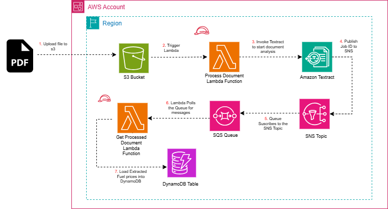

# Automated-EPRA-Fuel-Prices-Tracker-Across-Counties

## Overview
An automated AWS-native pipeline designed to extract, process, and store regional fuel prices in Kenya. This solution leverages **AWS Textract**'s advanced document analysis to parse structural tables from PDF documents (typically EPRA gazette notices) and stores the resulting data into **Amazon DynamoDB** for easy querying and downstream consumption.

## Architecture
The project follows a serverless, event-driven architecture deployed via **AWS CloudFormation**.



### Architecture Workflow
1. **Document Upload**: A PDF document (e.g., EPRA gazette notice) is uploaded to the landing S3 bucket.
2. **Analysis Trigger**: The upload event triggers the `ProcessDocument` Lambda function.
3. **AWS Textract Initiation**: The Lambda function starts an asynchronous table analysis job in AWS Textract.
4. **Completion Notification**: Once the analysis is complete, Textract sends a notification to an Amazon SNS Topic.
5. **Queueing**: The SNS Topic publishes the message to an **Amazon SQS Queue**, ensuring persistent delivery.
6. **Data Retrieval**: The SQS message triggers the `FetchDocument` Lambda function.
7. **Persistence**: The Lambda function retrieves the extracted tabular results, parses them, and stores the "Town-to-Fuel-Price" mapping in Amazon DynamoDB.

- **Amazon S3**: Acts as the landing zone for raw PDF fuel price documents.
- **AWS Lambda**: Two-stage serverless functions for initiating Textract jobs and post-processing results.
- **AWS Textract**: Automatically detects and extracts tabular data from document images.
- **Amazon SNS & SQS**: Decouples the asynchronous Textract process from the retrieval logic, providing reliability through queueing.
- **Amazon DynamoDB**: A fast and flexible NoSQL database storing the final "Town-to-Fuel-Price" mapping.
- **AWS CloudFormation**: Fully Infrastructure-as-Code (IaC) driven deployment.

## Getting Started

### Prerequisites
- [AWS CLI](https://aws.amazon.com/cli/) installed and configured.
- Appropriate IAM permissions to deploy CloudFormation stacks and manage the services listed above.
- Python 3.13 (or compatible).

### Deployment Sequence
This project consists of three main CloudFormation templates. Follow these steps in order:

#### 1. Package and Deploy Backend
The `backend-stack.yaml` template uses local Python scripts. You must package it first to upload the code to an S3 bucket and generate `package.yaml`.

**Package:**
```bash
aws cloudformation package \
  --template-file backend-stack.yaml \
  --s3-bucket your-artifact-bucket-name \
  --output-template-file package.yaml
```

**Deploy:**
```bash
aws cloudformation deploy \
  --template-file package.yaml \
  --stack-name FuelPriceBackendStack \
  --capabilities CAPABILITY_NAMED_IAM \
  --parameter-overrides \
     DocumentS3BucketName=your-unique-document-bucket \
     ArtifactBucketName=your-artifact-bucket-name \
     DocumentProcessingLambdaFunctionName=ProcessFuelDocument \
     GetProcessedDocumentLambdaFunctionName=FetchFuelData \
     TextractSNSTriggerRoleName=TextractSNSRole \
     SQSQueueName=TextractNotificationQueue
```

#### 2. Deploy Frontend
Once the backend is deployed, provision the frontend hosting resources using `frontend-stack.yaml`.

**Deploy:**
```bash
aws cloudformation deploy \
  --template-file frontend-stack.yaml \
  --stack-name FuelPriceFrontendStack \
  --parameter-overrides \
     Bucket=your-static-site-bucket-name \
     APIGateway=your-api-gateway-id \
     UserLambda=UserFunction \
     AdminLambda=AdminFunction
```

## File Structure
- `backend-stack.yaml`: Source backend template (uses local file references).
- `package.yaml`: Packaged backend template (uses S3 references, generated via `aws cloudformation package`).
- `frontend-stack.yaml`: Template for provisioning frontend S3 static hosting.
- `process-document.py`: Lambda logic for triggering Textract analysis.
- `fetch-document.py`: Lambda logic for post-processing Textract results and storage.
- `Textract.drawio.png`: Architecture diagram.
- `frontend/`: Source code for the static website.
- `epra-fuel.pdf`: Sample document for analysis.

## Cleanup
The stack includes a custom resource to automatically empty S3 buckets upon deletion, ensuring a clean teardown:
```bash
aws cloudformation delete-stack --stack-name FuelPriceBackendStack
aws cloudformation delete-stack --stack-name FuelPriceFrontendStack
```
