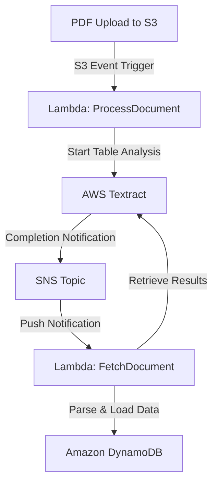

<<<<<<< Updated upstream
# Automated-EPRA-Fuel-Prices-Tracker-Across-Counties

## Overview
An automated AWS-native pipeline designed to extract, process, and store regional fuel prices in Kenya. This solution leverages **AWS Textract**'s advanced document analysis to parse structural tables from PDF documents (typically EPRA gazette notices) and stores the resulting data into **Amazon DynamoDB** for easy querying and downstream consumption.

## Architecture
The project follows a serverless, event-driven architecture deployed via **AWS CloudFormation**.


### Architecture Workflow
1. **Document Upload**: A PDF document (e.g., EPRA gazette notice) is uploaded to the landing S3 bucket.
2. **Analysis Trigger**: The upload event triggers the `ProcessDocument` Lambda function.
3. **AWS Textract Initiation**: The Lambda function starts an asynchronous table analysis job in AWS Textract.
4. **Completion Notification**: Once the analysis is complete, Textract sends a notification to an Amazon SNS Topic.
5. **Data Retrieval**: The SNS notification triggers the `FetchDocument` Lambda function.
6. **Persistence**: The Lambda function retrieves the extracted tabular results, parses them, and stores the "Town-to-Fuel-Price" mapping in Amazon DynamoDB.

### Core Components
=======
# ⛽ Automated-EPRA-Fuel-Prices-Tracker-Across-Counties

## 🌟 Overview
An automated AWS-native pipeline designed to extract, process, and store regional fuel prices in Kenya. This solution leverages **AWS Textract**'s advanced document analysis to parse structural tables from PDF documents (typically EPRA gazette notices) and stores the resulting data into **Amazon DynamoDB** for easy querying and downstream consumption.

## 🏗️ Architecture
The project follows a serverless, event-driven architecture deployed via **AWS CloudFormation**.



### 🛰️ Core Components
>>>>>>> Stashed changes
- **Amazon S3**: Acts as the landing zone for raw PDF fuel price documents.
- **AWS Lambda**: Two-stage serverless functions for initiating Textract jobs and post-processing results.
- **AWS Textract**: Automatically detects and extracts tabular data from document images.
- **Amazon SNS**: Decouples the asynchronous Textract process from the retrieval logic.
- **Amazon DynamoDB**: A fast and flexible NoSQL database storing the final "Town-to-Fuel-Price" mapping.
- **AWS CloudFormation**: Fully Infrastructure-as-Code (IaC) driven deployment.

<<<<<<< Updated upstream
## Getting Started
=======
## 🚀 Getting Started
>>>>>>> Stashed changes

### Prerequisites
- [AWS CLI](https://aws.amazon.com/cli/) installed and configured.
- Appropriate IAM permissions to deploy CloudFormation stacks and manage the services listed above.
- Python 3.13 (or compatible) for local testing of Lambda logic.

<<<<<<< Updated upstream
### Deployment
=======
### 🛠️ Deployment
>>>>>>> Stashed changes
1. **Clone the repository:**
   ```bash
   git clone https://github.com/TROISTROIS/Automated-EPRA-Fuel-Prices-Tracker-Across-Counties.git
   cd Automated-EPRA-Fuel-Prices-Tracker-Across-Counties
   ```

2. **Deploy the CloudFormation Stack:**
   Use the `backend-stack.yaml` template to provision all resources:
<<<<<<< Updated upstream
   ```bash
   aws cloudformation create-stack \
     --stack-name FuelPriceTrackerStack \
     --template-body file://backend-stack.yaml \
     --parameters \
        ParameterKey=DocumentS3BucketName,ParameterValue=your-unique-bucket-name \
        ParameterKey=ZipCodeBucketName,ParameterValue=your-lambda-code-bucket \
=======
   ```powershell
   aws cloudformation create-stack `
     --stack-name FuelPriceTrackerStack `
     --template-body file://backend-stack.yaml `
     --parameters `
        ParameterKey=DocumentS3BucketName,ParameterValue=your-unique-bucket-name `
        ParameterKey=ZipCodeBucketName,ParameterValue=your-lambda-code-bucket `
>>>>>>> Stashed changes
     --capabilities CAPABILITY_NAMED_IAM
   ```

3. **Upload Lambda Code:**
   Ensure your Python scripts (`process-document.py` and `fetch-document.py`) are zipped and uploaded to the `ZipCodeBucketName` before deploying or updating the stack.

<<<<<<< Updated upstream
## File Structure
=======
## 📁 File Structure
>>>>>>> Stashed changes
- `backend-stack.yaml`: The CloudFormation template defining the entire AWS environment.
- `process-document.py`: Lambda function that triggers Textract's asynchronous analysis.
- `fetch-document.py`: Lambda function that retrieves, parses, and persists the extracted data.
- `.gitignore`: Standard exclusion list for Git.

<<<<<<< Updated upstream
## Cleanup
The stack includes a custom resource to automatically empty S3 buckets upon deletion, ensuring a clean teardown:
```bash
=======
## 🧹 Cleanup
The stack includes a custom resource to automatically empty S3 buckets upon deletion, ensuring a clean teardown:
```powershell
>>>>>>> Stashed changes
aws cloudformation delete-stack --stack-name FuelPriceTrackerStack
```


